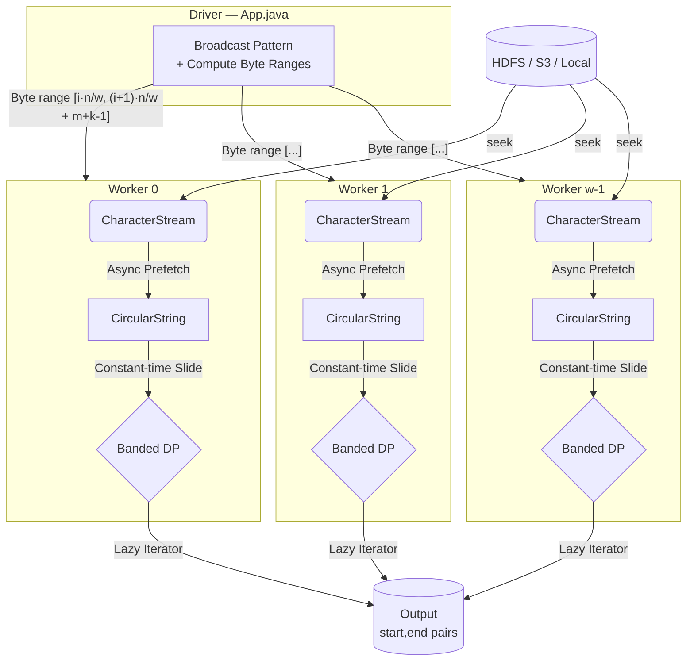

# DNA Sequence Analysis — Distributed Approximate Pattern Matching

A scalable framework for finding all approximate matches of a pattern in a genomic-scale DNA sequence using **banded dynamic programming** and **Apache Spark** for distributed execution.

## Problem

Given:
- A DNA **sequence** of length `n` (up to ~10¹⁰ characters)
- A **pattern** of length `m` (~10⁵ characters)
- An error threshold **k** (30–60)

Find all substrings of the sequence whose **edit distance** (insertions, deletions, substitutions) to the pattern is ≤ k.

## Architecture



> Each worker reads `n/w + (m+k-1)` bytes — the `m+k-1` overlap ensures matches spanning partition boundaries are never missed, eliminating the need for any inter-worker shuffle.

### Core Components
| Component | File | Role |
|-----------|------|------|
| **Spark Orchestrator** | `App.java` | Broadcasts the pattern, computes partition boundaries, and triggers the MapReduce job. |
| **Banded DP Core** | `Algorithms.java` | Computes edit distance in `O(mk)` time using a rolling 1D array of size `2k+1`, bypassing standard `O(m²)` overhead. |
| **Streaming Buffer** | `CircularString.java` | A ring buffer that maintains the current evaluation window. It features O(1) shifts and uses `CompletableFuture` to prefetch upcoming bytes. |
| **File Abstraction** | `CharacterStream.java` | Uses Hadoop's `FileSystem` API for distributed reading, allowing random `seek()` access to chunk boundaries. |

## Prerequisites

- **Java 11**
- **Maven 3.x**
- **Apache Spark 3.5.x** (bundled as dependency — no separate install needed for local mode)

## Build

```bash
mvn clean install
```

## Usage

### Spark Mode (distributed / local)

```bash
mvn -q compile exec:java \
  -Dexec.mainClass="iitism.ugproject.mr_dna_seq_analysis.App" \
  -Dexec.args="<seqFile> <patFile> <k> <w> <outDir>"
```

| Arg | Description |
|-----|-------------|
| `seqFile` | Path to DNA sequence file (local or HDFS) |
| `patFile` | Path to pattern file (local or HDFS) |
| `k` | Max edit distance (error threshold) |
| `w` | Number of Spark partitions (≈ parallelism) |
| `outDir` | Output directory (must not exist) |

**Example:**

```bash
mvn -q compile exec:java \
  -Dexec.mainClass="iitism.ugproject.mr_dna_seq_analysis.App" \
  -Dexec.args="demo_sequence.txt demo_pattern.txt 1 2 demo_results"

cat demo_results/part-00000
```

### Worker Mode (single machine)

```bash
mvn -q compile exec:java \
  -Dexec.mainClass="iitism.ugproject.mr_dna_seq_analysis.Worker" \
  -Dexec.args="<id> <w> <seqFile> <patFile> <outFile> <k> <n>"
```

| Arg | Description |
|-----|-------------|
| `id` | Worker ID (0-based) |
| `w` | Total number of workers |
| `seqFile` | Path to DNA sequence file |
| `patFile` | Path to pattern file |
| `outFile` | Output file for match pairs |
| `k` | Max edit distance |
| `n` | Total sequence length in characters |

**Example (single worker):**

```bash
rm -f demo_output.txt
mvn -q compile exec:java \
  -Dexec.mainClass="iitism.ugproject.mr_dna_seq_analysis.Worker" \
  -Dexec.args="0 1 demo_sequence.txt demo_pattern.txt demo_output.txt 1 39"

cat demo_output.txt
```

### Output Format

Each line is a `start,end` pair indicating that `sequence[start..end]` is an approximate match:

```
2,7
11,16
22,28
32,37
```

## Quick Demo

Create test files:

```bash
echo -n "CCATGCGACCCATGCCACCCCCAATGCGACCCATGCGGC" > demo_sequence.txt
echo -n "ATGCGA" > demo_pattern.txt
```

Run with k=1:

```bash
rm -f demo_output.txt
mvn -q compile exec:java \
  -Dexec.mainClass="iitism.ugproject.mr_dna_seq_analysis.Worker" \
  -Dexec.args="0 1 demo_sequence.txt demo_pattern.txt demo_output.txt 1 39"
cat demo_output.txt
```

Expected output — 13 matches demonstrating all edit types:

```
1,7    ← CATGCGA   (1 insertion)
2,6    ← ATGCG     (1 deletion)
2,7    ← ATGCGA    (exact match)
2,8    ← ATGCGAC   (1 insertion)
3,7    ← TGCGA     (1 deletion)
11,16  ← ATGCCA    (1 substitution: G→C)
22,28  ← AATGCGA   (1 insertion: extra A)
23,27  ← ATGCG     (1 deletion)
23,28  ← ATGCGA    (exact match)
23,29  ← ATGCGAC   (1 insertion)
24,28  ← TGCGA     (1 deletion)
32,36  ← ATGCG     (1 deletion)
32,37  ← ATGCGG    (1 substitution: A→G)
```

## Complexity

| Mode | Time | Space per machine |
|------|------|-------------------|
| Sequential | O(n·m·k) | O(m + k) |
| Distributed (w workers) | O((n/w)·m·k) | O(m + k) |

## Running Tests

```bash
mvn test
```

## Tech Stack

- **Java 11** — Language
- **Apache Spark 3.5.1** — Distributed computing
- **Hadoop FileSystem API** — HDFS / local file abstraction
- **Maven + Shade Plugin** — Build & fat JAR packaging
- **JUnit 5** — Testing

## Project Structure

```
src/main/java/iitism/ugproject/mr_dna_seq_analysis/
├── App.java              # Spark driver — distributed orchestrator
├── Worker.java           # Standalone single-machine worker
├── Algorithms.java       # Banded DP (ApproximateEditDistance)
├── CircularString.java   # Circular buffer with async prefetch
└── CharacterStream.java  # HDFS-backed character stream

src/test/java/iitism/ugproject/mr_dna_seq_analysis/
├── AlgorithmsTest.java         # DP correctness vs naive Levenshtein
├── CircularStringTest.java     # Circular buffer operations
├── CharacterStreamTest.java    # Stream reading tests
├── WorkerTest.java             # End-to-end worker test
├── AppTest.java                # Spark integration test
└── PresentationDemoTest.java   # Demo test case with annotated output
```
